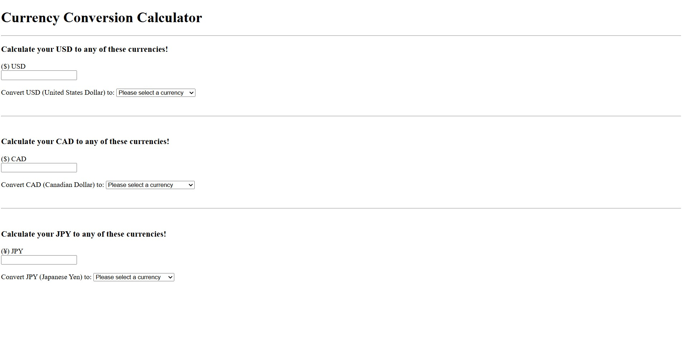
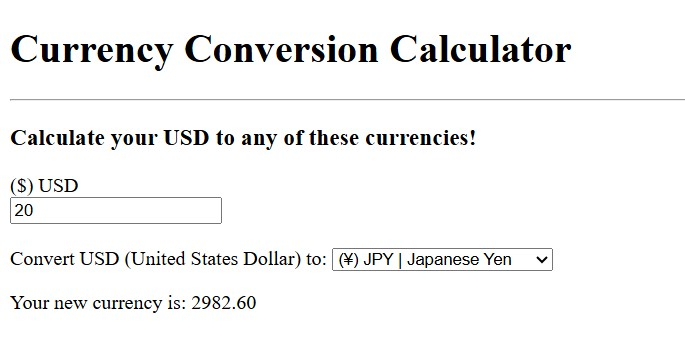

<h1>Currency Conversion Calculator</h1>


<h2>Description</h2>
<p>Project consists of three currency conversion choices:
  <br>
    <ul>
      <li>USD ➔ EURO, CAD, or JPY</li> 
      <br> 
      <li>CAD ➔ GBP, AUD, or ISK</li> 
      <br> 
      <li>JPY ➔ GYD, INR, or FJD</li>
    </ul>
  </p>
<br />


<h2>Languages and Utilities Used</h2>

- <b>HTML</b>
- <b>JavaScript</b>
- <b>Visual Studio Code</b>

<h2>Environments Used </h2>

- <b>Windows 11</b>

<h2>Program Walkthrough:</h2>


<p>The following image shows the front page of the Currency Conversion Calculator where a user can enter an amount of USD, CAD, or JPY to be converted to three different currencies.</p>

<br />
<br />

<p>As an example I entered 20 USD to be converted to JPY and in return my new currency is 2982.60 JPY</p>



<!--
 ```diff
- text in red
+ text in green
! text in orange
# text in gray
@@ text in purple (and bold)@@
```
--!>
